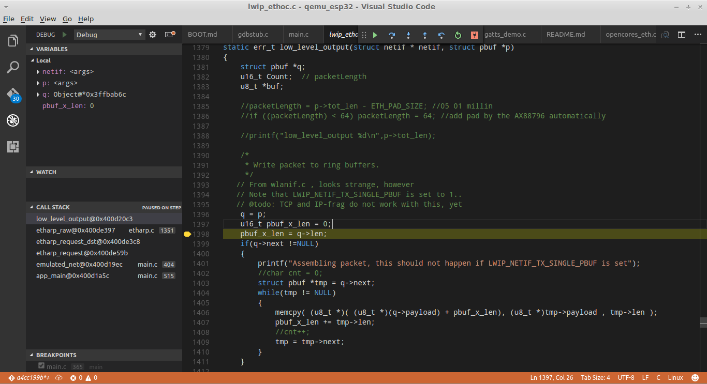

#  Setting up visual studio code 
```
https://code.visualstudio.com/download

If you are running a older linuw or redhat you might have libc < 2.18
Then the C/C++ extension might not work. This means no intellisense.
Here is a tip on how to fix that problem.
https://github.com/Microsoft/vscode-cpptools/issues/19#issuecomment-247211865
For just the Visual studio code ide you only need glibc2.15.

Install extension C/C++ & Native debug (webfreak)
```

Look att my examples in the directory .vscode

#Compiling
Visual studio code works fine for navigating both qemu and esp32 sources
Press ctrl-shift-P 
type tasks, select configure task runner, select other, This is for compiling qemu.
```
{
    "version": "0.1.0",
    "command": "make",
    "isShellCommand": true,
    "options": {
        "cwd": "${workspaceRoot}/../qemu_esp32"
    },
    "tasks": [
        {
            "taskName": "Makefile",
            // Make this the default build command.
            "isBuildCommand": true,
            // Show the output window only if unrecognized errors occur.
            "showOutput": "always",
            // No args
            "args": ["all"],
            // Use the standard less compilation problem matcher.
            "problemMatcher": {
                "owner": "cpp",
                "fileLocation": ["relative", "${workspaceRoot}"],
                "pattern": {
                    "regexp": "^(.*):(\\d+):(\\d+):\\s+(warning|error):\\s+(.*)$",
                    "file": 1,
                    "line": 2,
                    "column": 3,
                    "severity": 4,
                    "message": 5
                }
            }
        },
        {
            "taskName": "clean app",
            "args": ["make app-clean"]
        },
        {
            "taskName": "monitor",
            "args": ["make monitor"]
        },
        {
            "taskName": "flash app",
            "args": ["make app-flash"]
        }

    ]
}
```
#  Header files 
.vscode/c_cpp_properties.json 
```
{
    "configurations": [
        {
            "name": "Linux",
            "includePath": ["~/esp-idf/components/"],
            "browse" : {
                "limitSymbolsToIncludedHeaders" : true,
                "databaseFilename" : ""
            }
        }
    ]
}
```

Now go to File->Preferences->Keyboard Shortcuts and add the following key binding for the build task:

```
// Place your key bindings in this file to overwrite the defaults
[
    { "key": "f8",          "command": "workbench.action.tasks.build" }
]
```

# More info

https://github.com/espressif/esp-idf/issues/303

# Debugging
Look at the .vscode/launch.json file.
```
{
    "version": "0.2.0",
    "configurations": [
        {
            "name": "Debug",
            "gdbpath": "~/esp/xtensa-esp32-elf/bin/xtensa-esp32-elf-gdb",
            "type": "gdb",
            "request": "attach",
            "executable" : "${workspaceRoot}/build/app-template.elf",
            "target": ":1234",
            "remote": true,
            "cwd": "${workspaceRoot}"
        }
    ]
}
```

When running the debugger, start qemu before launching the debugger then do
```
> interrupt
> b app_main
Then do reset in qemu
> c
```
A bit annoying but for hight level c functions it is nice to have a gdb gui.

[[https://raw.githubusercontent.com/Ebiroll/qemu_esp32/master/img/vscode.png]]




## Setting up platformio
Here is another ide that uses the atom editor, could be useful if it gets better.
[I would not currentrly recomed this, Setup Platform.io](./platformio.md)
http://platformio.org/platformio-ide

