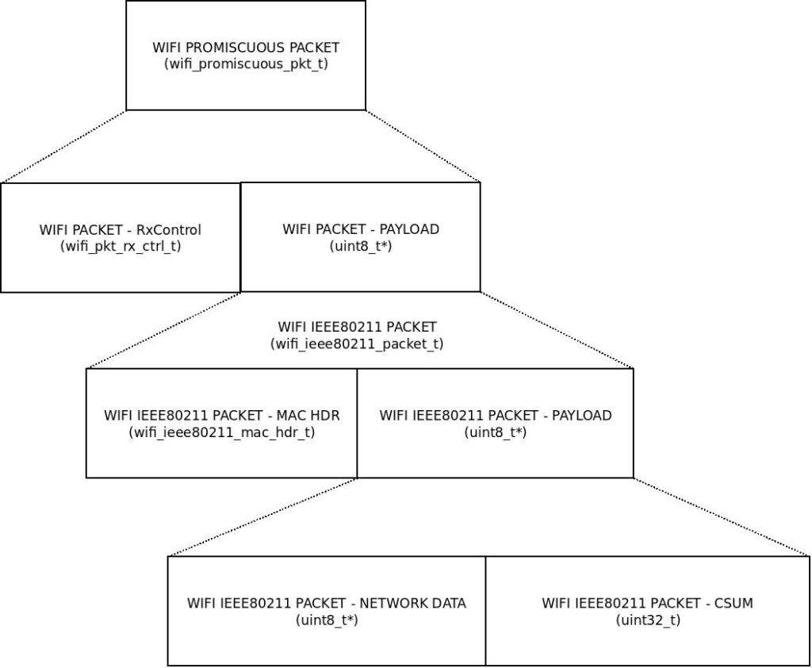

ESP32 - WiFi Sniffer
====================

Example from here, http://blog.podkalicki.com/esp32-wifi-sniffer/
Does not yet tun in qemu but hopefully it will start one day.




Experimental WiFi Sniffer with automated channel switching. This project is using `Espressif IoT Development Framework`_ (ESP-IDF) and has been tested on ESP-WROOM-32 module. More details on my blog - http://blog.podkalicki.com/esp32-wifi-sniffer/

.. _Espressif IoT Development Framework: https://github.com/espressif/esp-idf

Now also runs in qemu,

ets Jun  8 2016 00:22:57

```
rst:0x10 (RTCWDT_RTC_RESET),boot:0x13 (SPI_FAST_FLASH_BOOT)
configsip: 0, SPIWP:0xee
clk_drv:0x00,q_drv:0x00,d_drv:0x00,cs0_drv:0x00,hd_drv:0x00,wp_drv:0x00
mode:DIO, clock div:2
load:0x3fff0030,len:4
load:0x3fff0034,len:5596
load:0x40078000,len:13176
load:0x40080400,len:3724
entry 0x40080644
HOST RER TBD
I (103) cpu_start: Pro cpu up.
I (103) cpu_start: Application information:
I (103) cpu_start: Project name:     wifi_sniffer
I (103) cpu_start: App version:      87901ef-dirty
I (103) cpu_start: Compile time:     Apr  8 2021 22:42:06
I (103) cpu_start: ELF file SHA256:  6854060be926887b...
I (103) cpu_start: ESP-IDF:          v4.2-dev-1660-g7d7521367-dirty
I (103) cpu_start: Single core mode
I (103) heap_init: Initializing. RAM available for dynamic allocation:
I (103) heap_init: At 3FFAE6E0 len 00001920 (6 KiB): DRAM
I (103) heap_init: At 3FFB88A0 len 00027760 (157 KiB): DRAM
I (103) heap_init: At 3FFE0440 len 0001FBC0 (126 KiB): D/IRAM
I (103) heap_init: At 40078000 len 00008000 (32 KiB): IRAM
I (104) heap_init: At 40094FA4 len 0000B05C (44 KiB): IRAM
I (104) cpu_start: Pro cpu start user code
esp32_i2c_interruptSet: new IRQ val 0xc0e54970
I (271) spi_flash: detected chip: issi
I (271) spi_flash: flash io: dio
W (271) spi_flash: Detected size(4096k) larger than the size in the binary image header(2048k). Using the size in the binary image header.
I (272) cpu_start: Starting scheduler on PRO CPU.
I (276) wifi:wifi driver task: 3ffbef8c, prio:23, stack:6656, core=0
I (276) system_api: Base MAC address is not set
I (276) system_api: read default base MAC address from EFUSE
I (281) wifi:wifi firmware version: 517093f
I (281) wifi:wifi certification version: v7.0
I (281) wifi:config NVS flash: enabled
I (281) wifi:config nano formating: disabled
I (281) wifi:Init dynamic tx buffer num: 32
I (281) wifi:Init data frame dynamic rx buffer num: 32
I (281) wifi:Init management frame dynamic rx buffer num: 32
I (281) wifi:Init management short buffer num: 32
I (281) wifi:Init static rx buffer size: 1600
I (281) wifi:Init static rx buffer num: 10
I (281) wifi:Init dynamic rx buffer num: 32
W (281) phy_init: failed to load RF calibration data (0x1102), falling back to full calibration
I (284) phy: error: pll_cal exceeds 2ms!!!
I (286) phy: error: pll_cal exceeds 2ms!!!
I (288) phy: error: pll_cal exceeds 2ms!!!
I (290) phy: error: pll_cal exceeds 2ms!!!
I (292) phy: error: pll_cal exceeds 2ms!!!
I (294) phy: error: pll_cal exceeds 2ms!!!
I (296) phy: error: pll_cal exceeds 2ms!!!
I (299) phy: error: pll_cal exceeds 2ms!!!
I (301) phy: error: pll_cal exceeds 2ms!!!
I (303) phy: error: pll_cal exceeds 2ms!!!
I (305) phy: error: pll_cal exceeds 2ms!!!
I (307) phy: error: pll_cal exceeds 2ms!!!
I (309) phy: error: pll_cal exceeds 2ms!!!
I (311) phy: error: pll_cal exceeds 2ms!!!
I (314) phy: error: pll_cal exceeds 2ms!!!
I (316) phy: error: pll_cal exceeds 2ms!!!
...
I (437) phy: error: pll_cal exceeds 2ms!!!
I (440) phy: error: pll_cal exceeds 2ms!!!
I (442) phy: error: pll_cal exceeds 2ms!!!
I (444) phy: error: pll_cal exceeds 2ms!!!
I (446) phy: error: pll_cal exceeds 2ms!!!
I (448) phy: error: pll_cal exceeds 2ms!!!
I (450) phy: error: pll_cal exceeds 2ms!!!
I (452) phy: error: pll_cal exceeds 2ms!!!
I (455) phy: error: pll_cal exceeds 2ms!!!
I (457) phy: error: pll_cal exceeds 2ms!!!
I (459) phy: error: pll_cal exceeds 2ms!!!
I (461) phy: error: pll_cal exceeds 2ms!!!
I (463) phy: error: pll_cal exceeds 2ms!!!
I (484) phy: error: pll_cal exceeds 2ms!!!
I (486) phy: phy_version: 4181, c9a03e2, Mar 10 2020, 12:45:06, 0, 2
I (488) wifi:mode : null
I (488) wifi:ic_enable_sniffer
```

No data is emulated, but it is possible to step deep into the libraries.


